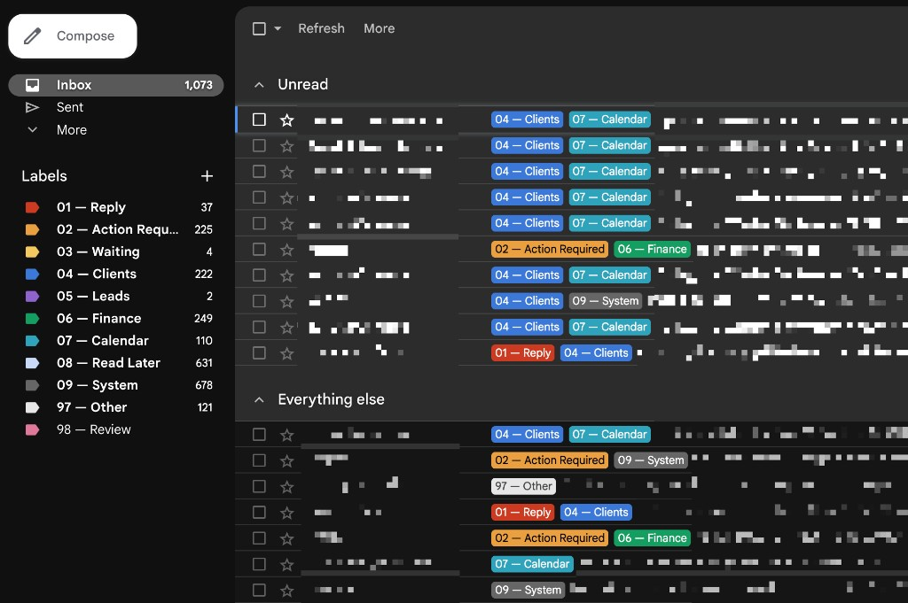

# Gmail + Jev Inbox Triage

Open-source **Gmail inbox triage** powered by [TypeSafe](https://typesafe.ai) **Jev** (System One).

It reads threads from your inbox, asks Jev for typed judgments (not free-form chat), then applies a fixed set of workflow labels — and optionally archives mail that does not need a reply or action.

This repository is a cleaned, shareable version of a private production system. It does **not** ship credentials, mailbox contents, decision logs, or runtime state.

---

## How it looks

After processing, Gmail shows numbered workflow labels in the sidebar and as colored pills on each thread. A thread can receive more than one label (for example **Clients** + **Calendar**, or **Action Required** + **Finance**).



---

## Table of contents

1. [Who this is for](#who-this-is-for)
2. [What you will need](#what-you-will-need)
3. [Quick start (checklist)](#quick-start-checklist)
4. [Step-by-step setup](#step-by-step-setup)
5. [First safe run (dry-run)](#first-safe-run-dry-run)
6. [Apply labels for real](#apply-labels-for-real)
7. [Continuous automation](#continuous-automation)
8. [Workflow labels](#workflow-labels)
9. [How classification works](#how-classification-works)
10. [Customize labels, rules, and prompts](#customize-labels-rules-and-prompts)
11. [Configuration reference](#configuration-reference)
12. [Project layout](#project-layout)
13. [Migration helpers](#migration-helpers)
14. [Security](#security)
15. [FAQ](#faq)
16. [License](#license)

---

## Who this is for

| You are… | Start here |
| --- | --- |
| New to the project | [Quick start](#quick-start-checklist) → [Step-by-step setup](#step-by-step-setup) |
| Comfortable with Python / APIs | Clone, follow Google + TypeSafe sections, run dry-run |
| Tuning behavior | [Customize labels, rules, and prompts](#customize-labels-rules-and-prompts) + [FAQ](#faq) |
| Migrating an old label scheme | [Migration helpers](#migration-helpers) |

You should be comfortable doing **one** of the following:

- Handling these steps yourself: running terminal commands, creating a Google Cloud project and downloading OAuth credentials, and editing a few Python/config files if you want custom labels or thresholds  
- **or** walking through the same steps with an AI assistant (ChatGPT, Claude, Cursor, etc.) without needing deep technical knowledge or hand-editing code yourself

You do **not** need to train a model. Jev is used through the TypeSafe API.

> **Caution — your responsibility:** Email often contains highly sensitive personal, financial, legal, and business information. This software runs under **your** Google account and API keys, can read message content, and can change labels / archive mail. Review the setup, start with dry-run, and only enable live writes if you accept the privacy, security, and operational risks. The authors are not responsible for data exposure, mis-labeling, or mailbox changes caused by your configuration or use.

---

## What you will need

### Accounts and keys

| Dependency | Where to get it | What you create locally |
| --- | --- | --- |
| **TypeSafe API key** | [typesafe.ai](https://typesafe.ai) — create an account and API key | Put the key in `.env` as `TYPESAFE_API_KEY` |
| **Google Cloud project** | [Google Cloud Console](https://console.cloud.google.com/) | Project with **Gmail API** enabled |
| **OAuth Desktop client** | APIs & Services → Credentials → Create credentials → OAuth client ID → **Desktop app** | Download JSON and save as `credentials.json` in the project root |
| **Gmail mailbox** | The Google account you authorize | First run creates `token.json` (gitignored) |

### Software

| Dependency | Notes |
| --- | --- |
| **Python 3.11+** (3.12 recommended) | `python3 --version` |
| **pip** + **venv** | Used to install `requirements.txt` |
| Packages | `typesafe-sdk`, `python-dotenv`, Google API / auth libraries (see `requirements.txt`) |

### Optional but useful

| Item | Why |
| --- | --- |
| `clients.local.json` | Boost **Clients** labeling for known domains/keywords |
| `MAILBOX_OWNER_NAME` | Makes Jev prompts use your name (“Alex”) instead of “the mailbox owner” |
| cron or launchd | Run live/backfill workers automatically |

---

## Quick start (checklist)

Use this as a progress tracker:

1. [ ] Clone the repo and create a Python virtualenv  
2. [ ] Install dependencies from `requirements.txt`  
3. [ ] Create a TypeSafe API key → put it in `.env`  
4. [ ] Enable Gmail API + create Desktop OAuth client → save `credentials.json`  
5. [ ] (Optional) Copy `clients.example.json` → `clients.local.json` and edit  
6. [ ] Run `python jev_test.py` and `python gmail_test.py`  
7. [ ] Run a **dry-run**: `DRY_RUN=true MAX_RESULTS=10 python main.py`  
8. [ ] Review `validation.jsonl`  
9. [ ] Run for real: `DRY_RUN=false python main.py`  
10. [ ] (Optional) Schedule `live_worker.py` / `backfill_worker.py`

---

## Step-by-step setup

### 1. Get the code

```bash
git clone https://github.com/forestwas/gmail-jev.git
cd gmail-jev
```

### 2. Create a virtual environment and install packages

```bash
python3 -m venv .venv
source .venv/bin/activate          # Windows: .venv\Scripts\activate
pip install -r requirements.txt
```

Or with the project metadata:

```bash
pip install -e .
```

### 3. Get a TypeSafe API key

1. Open [typesafe.ai](https://typesafe.ai) and create an account.  
2. Create an API key in the dashboard.  
3. Keep it private — treat it like a password.

```bash
cp .env.example .env
```

Edit `.env`:

```env
TYPESAFE_API_KEY=your_key_here
MAILBOX_OWNER_NAME=Alex
DRY_RUN=true
MAX_RESULTS=100
```

`main.py` loads `.env` automatically via `python-dotenv`.

### 4. Set up Google Cloud + Gmail OAuth

Do this once per Google Cloud project / mailbox.

1. Go to [Google Cloud Console](https://console.cloud.google.com/).  
2. Create a project (or select one).  
3. Open **APIs & Services → Library**, search for **Gmail API**, click **Enable**.  
4. Open **APIs & Services → OAuth consent screen**.  
   - Choose **External** (or Internal if you use Google Workspace and it fits your org).  
   - Fill required app name / support email.  
   - Add your Google account as a **test user** while the app is in Testing.  
5. Open **APIs & Services → Credentials → Create credentials → OAuth client ID**.  
   - Application type: **Desktop app**.  
   - Create, then **Download JSON**.  
6. Save the downloaded file in the project root as:

```text
credentials.json
```

The app requests this scope:

```text
https://www.googleapis.com/auth/gmail.modify
```

That allows reading mail and changing labels / inbox membership. It does **not** send email as you unless you add other scopes (this project does not).

### 5. Optional: known clients file

```bash
cp clients.example.json clients.local.json
```

Edit domains and keywords for companies you already work with:

```json
{
  "clients": [
    {
      "name": "Acme",
      "domains": ["acme.com"],
      "keywords": ["Project Nova"]
    }
  ]
}
```

If a domain or keyword appears in the subject, body, or From/To/Cc headers, the thread is forced toward **`04 — Clients`** (see routing rules below).

### 6. Smoke tests

```bash
python jev_test.py      # TypeSafe / Jev connectivity
python gmail_test.py    # Opens a browser for OAuth; prints your Gmail profile
```

After a successful Gmail login, `token.json` appears in the project root (gitignored). Reuse it on later runs; refresh happens automatically when possible.

### 7. Unit tests (no network)

```bash
python -m unittest discover -v
```

---

## First safe run (dry-run)

Dry-run classifies threads and writes proposals **without** changing Gmail labels.

```bash
DRY_RUN=true MAX_RESULTS=10 python main.py
```

What happens:

- Workflow labels are **not** created/applied in Gmail (placeholder IDs are used in memory).  
- Results are appended to **`validation.jsonl`**.  
- Console output shows subject, Jev answers, and proposed labels.

Read the JSONL file and spot-check a few threads before enabling writes.

---

## Apply labels for real

```bash
# In .env you can set DRY_RUN=false, or override for one run:
DRY_RUN=false MAX_RESULTS=50 python main.py
```

What happens:

- Missing workflow labels are **created** in Gmail if needed.  
- Matching labels are applied to each processed thread.  
- Some threads may leave Inbox (archive) when rules say it is safe.  
- Decisions append to **`decisions.jsonl`**.

Default search: inbox threads that do **not** already have any of the workflow labels. That way each thread is processed once until you strip labels (or a worker re-queues it).

---

## Continuous automation

| Script | Role |
| --- | --- |
| `live_worker.py` | Recent inbox (`newer_than:2d`). Uses Gmail history to re-queue threads that got new messages. |
| `backfill_worker.py` | Older unprocessed inbox (`older_than:1d`), one batch per run. |

Both call `main.py` with an appropriate `GMAIL_QUERY` and use file locks so overlapping runs exit safely.

Suggested cadence: live every few minutes; backfill hourly (or less often).

### Environment variables for workers

`main.py` loads `.env`, but cron/launchd often need an explicit wrapper. Example templates live in `scripts/`:

```bash
cp scripts/run_live.sh.example run_live.sh
cp scripts/run_backfill.sh.example run_backfill.sh
chmod +x run_live.sh run_backfill.sh
# edit if needed; keep real wrappers local (they source .env)
```

### cron example

```cron
*/5 * * * *  /path/to/gmail-jev/run_live.sh
0 * * * *    /path/to/gmail-jev/run_backfill.sh
```

### launchd example (macOS)

Save `~/Library/LaunchAgents/com.example.gmail-jev.live.plist`:

```xml
<?xml version="1.0" encoding="UTF-8"?>
<!DOCTYPE plist PUBLIC "-//Apple//DTD PLIST 1.0//EN"
  "http://www.apple.com/DTDs/PropertyList-1.0.dtd">
<plist version="1.0">
<dict>
  <key>Label</key>
  <string>com.example.gmail-jev.live</string>
  <key>WorkingDirectory</key>
  <string>/path/to/gmail-jev</string>
  <key>ProgramArguments</key>
  <array>
    <string>/path/to/gmail-jev/run_live.sh</string>
  </array>
  <key>StartInterval</key>
  <integer>300</integer>
  <key>StandardOutPath</key>
  <string>/path/to/gmail-jev/live-launchd-out.log</string>
  <key>StandardErrorPath</key>
  <string>/path/to/gmail-jev/live-launchd-error.log</string>
</dict>
</plist>
```

```bash
chmod +x /path/to/gmail-jev/run_live.sh
launchctl load ~/Library/LaunchAgents/com.example.gmail-jev.live.plist
```

Prefer a wrapper script that sources `.env` over putting secrets inside the plist.

---

## Workflow labels

These names are the system’s contract. Number prefixes keep them sorted in Gmail’s label list.

| Label | Meaning |
| --- | --- |
| `01 — Reply` | Human conversation likely needs a written reply |
| `02 — Action Required` | Concrete non-reply action needed |
| `03 — Waiting` | You already acted; waiting on someone else |
| `04 — Clients` | Known client match or high-confidence client relationship |
| `05 — Leads` | Genuine sales / project inquiry |
| `06 — Finance` | Billing, invoices, receipts, insurance, etc. |
| `07 — Calendar` | Real calendar invite / calendar-system event (or MIME `.ics` evidence) |
| `08 — Read Later` | Newsletters / bulk reading |
| `09 — System` | System, security, or file-share notifications |
| `97 — Other` | Processed successfully, but no useful class matched |
| `98 — Review` | Model was uncertain; needs a human look |

Label **colors** in Gmail are cosmetic. Set them in Gmail → Settings → Labels (or the label color picker). The automation only creates names; it does not set colors.

---

## How classification works

```
live_worker / backfill_worker / manual main.py
                    │
                    ▼
                 main.py
           ┌────────┴────────┐
           ▼                 ▼
     Gmail API          TypeSafe Jev
   (read thread)     (typed judgments)
           │                 │
           └────────┬────────┘
                    ▼
              routing.py
         (thresholds → label names)
                    ▼
            apply labels / archive
```

For each thread, Jev answers questions such as:

- **relationship** — client / lead / personal / other  
- **message_type** — human_message, finance, calendar, newsletter, security, file_share, system, other  
- **reply_needed**, **action_required**, **waiting_on_them**, **can_archive** (numeric confidence-style scores)  
- **urgency**, **revenue_relevance** (logged; not required for core labels)

Then deterministic code in `routing.py` turns those answers into label names and an archive decision.

Special case: if the MIME tree contains `text/calendar` or an `.ics` part, **message type is forced to calendar** regardless of the model.

---

## Customize labels, rules, and prompts

### Change label **names**

1. Edit `WORKFLOW_LABELS` in [`workflow.py`](workflow.py).  
2. Update the same strings in [`routing.py`](routing.py) (`decide_label_names`).  
3. Update Jev prompt text in [`main.py`](main.py) (`build_jev_questions`) if wording should match.  
4. Update worker queries indirectly by keeping `WORKFLOW_LABELS` as the single list for exclusions.  
5. Run unit tests.  
6. In Gmail, rename or delete old labels manually if you no longer want them.

**Important:** Gmail label names must match the strings in code exactly (including the unicode em dash `—`).

### Change label **colors**

In Gmail only (UI). No code change required.

### Change **routing thresholds** (when a label applies)

Edit [`routing.py`](routing.py):

| Knob | Default idea | File location |
| --- | --- | --- |
| Message-type confidence floors | e.g. finance `0.40`, calendar `0.60` | `MESSAGE_TYPE_THRESHOLDS` |
| Relationship confidence | `0.55` for client/lead | `decide_label_names` |
| Reply | `reply_needed >= 0.50` and human message | `decide_label_names` |
| Action required | `0.70` generally, `0.50` for system/security/file_share | `decide_label_names` |
| Waiting | `waiting_on_them >= 0.70` | `decide_label_names` |
| Uncertainty → Review | relationship & message_type confidence both `< 0.55` | `decide_label_names` |
| Archive newsletter | newsletter confidence `>= 0.65` | `should_archive_thread` |
| Archive via can_archive | `can_archive >= 0.70` and low reply/action | `should_archive_thread` |

After edits:

```bash
python -m unittest discover -v
```

### Change **what Jev is asked**

Edit `build_jev_questions()` in [`main.py`](main.py).

Tips:

- Keep criteria mutually exclusive where possible.  
- Use `MAILBOX_OWNER_NAME` so instructions say “Alex” instead of a generic owner.  
- Prefer improving criteria text before adding more labels.

### Change **which mail is fetched**

| Goal | How |
| --- | --- |
| One-off custom search | `GMAIL_QUERY='in:inbox newer_than:7d' python main.py` |
| Live window | `LIVE_QUERY` builder in `workflow.py` (`newer_than:2d`) |
| Backfill window | `BACKFILL_QUERY` (`older_than:1d`) |
| Batch size | `MAX_RESULTS` |

### Change **known clients**

Edit `clients.local.json` (or point `KNOWN_CLIENTS_FILE` elsewhere). No code deploy needed — next `main.py` run reloads the file.

---

## Configuration reference

| Variable | Default | Purpose |
| --- | --- | --- |
| `TYPESAFE_API_KEY` | _(required)_ | TypeSafe API access |
| `MAILBOX_OWNER_NAME` | `the mailbox owner` | Name used in Jev prompt framing |
| `DRY_RUN` | `false` in code / `true` in `.env.example` | Classify without Gmail writes |
| `MAX_RESULTS` | `100` | Threads per `main.py` run |
| `GMAIL_QUERY` | inbox excluding workflow labels | Override Gmail search |
| `KNOWN_CLIENTS_FILE` | `clients.local.json` | Known-client boosts |
| `GMAIL_RETRY_ATTEMPTS` | `6` | Retries for rate limits / transient errors |
| `APPLY_MIGRATION_RESET` | `false` | Allow `migration_reset.py` to remove labels |
| `MIGRATION_BATCH_SIZE` | `100` | `migration_runner.py` batch size |
| `MIGRATION_PAUSE_SECONDS` | `60` | Pause between migration batches |
| `MIGRATION_MAX_BATCHES` | `50` | Safety stop for migration runner |

---

## Project layout

| Path | Role |
| --- | --- |
| `main.py` | Classification engine (Gmail + Jev + apply labels) |
| `routing.py` | Pure label/archive decisions (unit-tested) |
| `workflow.py` | Shared label names and search queries |
| `gmail_utils.py` | MIME / header helpers |
| `live_worker.py` | Recent-mail scheduler entrypoint |
| `backfill_worker.py` | Older-mail batch entrypoint |
| `migration_reset.py` | Audit / strip workflow labels |
| `migration_runner.py` | Batch-process until inbox queue is empty |
| `clients.example.json` | Template for known clients |
| `test_routing.py` | Offline unit tests |
| `docs/inbox-preview.png` | Screenshot used above |

---

## Migration helpers

Use these when changing taxonomies or reprocessing mail.

```bash
# Audit only (writes a local snapshot JSONL; does not change Gmail)
python migration_reset.py

# Remove current + legacy workflow labels from matching inbox threads
APPLY_MIGRATION_RESET=true python migration_reset.py

# Process unprocessed inbox in batches until empty (or safety limit)
python migration_runner.py
```

Snapshots and decision logs may contain thread IDs and subjects — keep them private (gitignored).

---

## Security

> **Caution:** Mailboxes can contain passwords, contracts, medical or financial details, and private conversations. You are responsible for protecting credentials, reviewing what leaves your machine (API calls to TypeSafe/Google), and deciding whether this tool is appropriate for your data.

**Never commit:**

- `.env`, `credentials.json`, `token.json`, `clients.local.json`  
- `*.log`, `*.jsonl`, snapshots, lock files, mailbox exports  

The included `.gitignore` covers these patterns. Before every push, confirm `git status` is clean of secrets.

This tool can modify your mailbox (labels and inbox). Always dry-run first on a small `MAX_RESULTS`.

---

## FAQ

### Is this a hosted product?

No. You run it on your machine (or your own server). Your mail and keys stay under your control.

### Will it send email or delete messages?

No. It uses `gmail.modify` to add/remove labels and optionally remove the Inbox label (archive). It does not send messages and does not trash/delete threads.

### What is Jev / TypeSafe?

[TypeSafe](https://typesafe.ai) System One models return **typed judgments** (choices, yes/no-style scores, etc.) that software can branch on. Jev is the model used here. See the [TypeSafe docs](https://docs.typesafe.ai/).

### Dry-run still created labels in Gmail — why?

It should not. In dry-run, label IDs are placeholders (`DRYRUN::…`) and `threads.modify` is skipped. If you see real label changes, confirm `DRY_RUN` is `true`/`1`/`yes` in the environment for that process.

### OAuth consent screen says the app is unverified

Expected for personal/desktop use in Testing mode. Add your Google account as a test user. For broader distribution you would need Google verification — not required for personal use.

### `credentials.json` vs `token.json`

| File | Meaning |
| --- | --- |
| `credentials.json` | OAuth **client** secrets from Google Cloud (app identity) |
| `token.json` | **Your** authorized user token after browser login |

Both are secret. Only `credentials.json` is downloaded from Google; `token.json` is created locally.

### Gmail quota / rate limit errors

The client retries transient `403`/`429`/5xx responses. If you still hit quotas, lower `MAX_RESULTS`, increase pauses in `migration_runner.py`, or space out worker schedules.

### Threads are not being picked up

Common causes:

- They already have a workflow label (excluded by default query).  
- `GMAIL_QUERY` is too narrow.  
- Live worker only looks at `newer_than:2d` unless you run backfill / full `main.py`.  
- Another process holds the lock file (`.live.lock` / `.backfill.lock`).

### How do I reprocess a thread?

Remove its workflow labels in Gmail (or run `migration_reset.py` carefully), then run `main.py` again. The live worker also strips workflow labels when history reports a new message on an inbox thread, then re-runs classification.

### Can I use multiple Gmail accounts?

Yes, with separate working directories (or separate `token.json` / credential files and careful path management). This codebase assumes files in the project root by default.

### Can I rename “Clients” to “Customers”?

Yes — change the string in `workflow.py` and `routing.py` (and any docs). Create/migrate Gmail labels to match. Prefer a planned migration over renaming in Gmail only, or the code will create the new name as a second label.

### Why do some threads get two labels?

By design. Relationship/context labels (Clients, Leads, Finance, …) can combine with action labels (Reply, Action Required, Waiting).

### Why is Review empty or huge?

`98 — Review` is only used when the model is uncertain **and** no other label fired. If Review is huge, tighten prompts or lower uncertainty thresholds carefully. If empty, confidence is generally high enough to route elsewhere (including Other).

### Does Known Clients override Jev?

A domain/keyword hit forces the **Clients** label path for relationship. Jev still runs; other labels (Reply, Finance, etc.) can still apply from their own rules.

### Where should I report issues?

Open a GitHub issue on [forestwas/gmail-jev](https://github.com/forestwas/gmail-jev) with the command you ran, whether `DRY_RUN` was on, and a redacted snippet of console output (no raw email bodies or tokens).

### Is production data in this repo?

No. Do not copy production `.env`, tokens, decision logs, or mailbox exports into a public fork.

---

## License

[MIT](LICENSE) © Altay Suna
